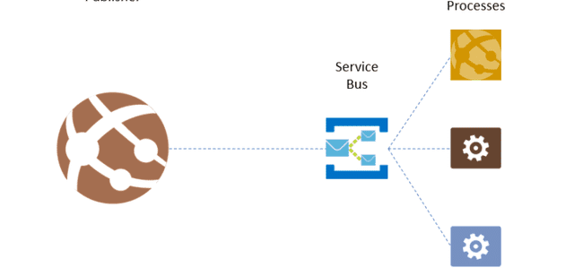
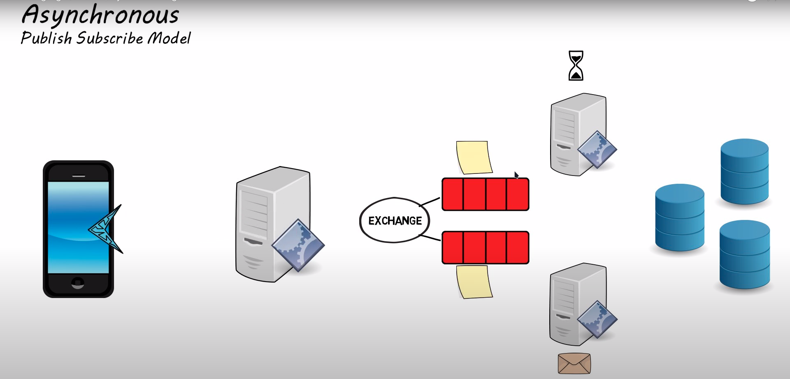
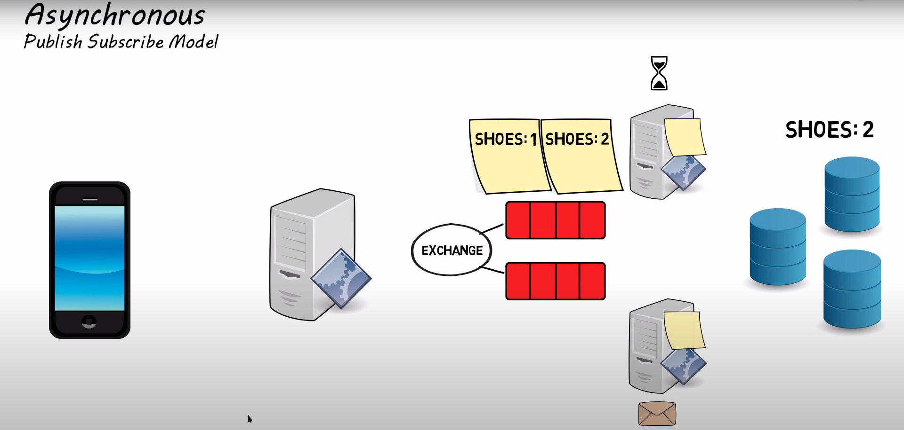

# Messaging Queue

---
### Let's start with "What is a Message Queue?"

In simple words, we may assume it to be a **linked list of messages**
which *helps two processes communicate with each other by sending a message and receiving a confirmation.*
Message Queues **follow the FIFO** rule.

---

#### **Why do we use Message Queues? or Why do we need them?**

    A "Message Queue" provides an "Asynchronous Communication Protocol"
    which means, a sender process can still perform its tasks without getting a
    confirmation from the receiver process; the receiver process may send the
    conformation message once, it's ready to receive new messages,
    until then the messages are stored in the message queue.
    Once the receiver process sends a confirmation to the sender process,
    the messages are removed from the Message Queue.

**The best use case for Asynchronous Communication is E-mail .**

    We can send as many emails as we want without receiving any confirmation from the receiver.
    When the receiver is ready to accept new messages(comes online), he/she can find them in the inbox itself.

**This way of handling messages creates a system** *that is easy to scale and maintain.*
**It allows different part of the system** *to evolve independently,* **regardless of which language it has been written in.**

---
#### Now, let's see "What are the best Message Queue Tools?"
  Some of the most popular tools to execute "Message Queue" are : 
* **Kafka** 
* **RabbitMQ**
* **Amazon SQS**
* **IBM MQ**
* **Celery**
* **ActiveMQ**
---

#### What is an Enterprise Message bus?

Using a **Message Bus** or **Service Bus** *one or more application/processes can
communicate messages to one or more other applications/processes.*
They **might or might not follow the FIFO** rule.
*Subscribers to the bus can come and go without the knowledge of message senders.*
**Unlike Message Queues**, where the sending application explicitly adds messages to every queue,
a **Message Bus** uses a *publish/subscribe model*. Messages are published to the bus,
and any application that has subscribed to that kind of message will receive it.

    This approach allows applications to follow the open/closed principle since they
    become open to future changes while remaining closed to additional modification.

---
# References
---
* [Message Queue vs Message Bus](https://ardalis.com/bus-or-queue/)
* [Message Queue (YouTube video)](https://www.youtube.com/watch?v=5-Rq4-PZlew)
* [one more YouTube video on Message Queue](https://www.youtube.com/watch?v=sfQwMu0SCT8)
* [Enterprise Messaging system](https://en.wikipedia.org/wiki/Enterprise_messaging_system)